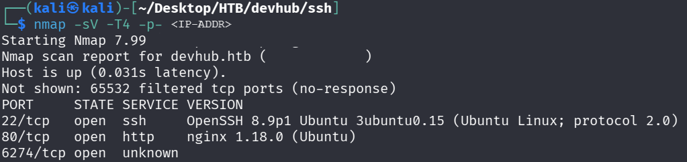
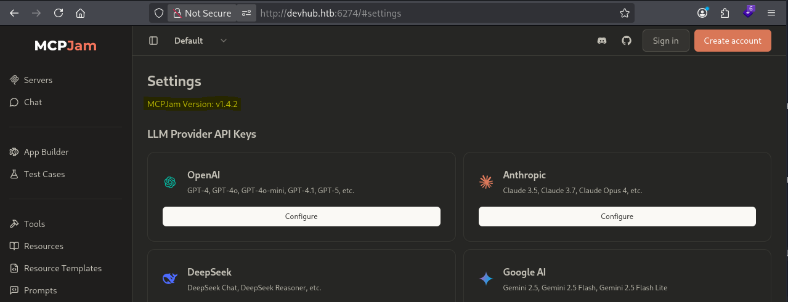

# Hack The Box — DevHub Walkthrough

## Machine Information
| Field | Value |
|------|------|
| Name | Facts |
| Platform | Hack The Box |
| OS | Linux |
| Difficulty | Medium |
| Release Date | 30th May, 2026 |

## Overview

DevHub is a Linux-based Hack The Box machine focused on web enumeration, internal service discovery, credential exposure, and privilege escalation through locally hosted development and operations services.  
  
The foothold involves identifying exposed web functionality and pivoting into internal services that are only accessible from the target host. Further enumeration reveals a Jupyter Lab instance and an internal operations MCP service, both of which play a key role in escalating privileges. The machine emphasizes careful process inspection, localhost service enumeration, SSH tunneling, API interaction, and abusing exposed administrative functionality.  

**Skills / Techniques**

- Web Enumeration
- Service Enumeration
- Localhost Service Discovery
- SSH Port Forwarding
- Jupyter Lab Token Abuse
- API Key Discovery
- Hidden API Endpoint Abuse
- Privilege Escalation
- Linux Post-Exploitation Enumeration

## Table of Contents

- Reconnaissance
- Enumeration
- Initial Access
- Internal Service Discovery
- SSH Tunneling
- Jupyter Lab Access
- Privilege Escalation
- Root Access
- Lessons Learned

## Recon
Initial information gathering and port scanning.
```
> nmap -sV -T4 -p- <IPADDRESS>  
### Findings:
- 22/tcp   open  ssh     OpenSSH 8.9p1 Ubuntu 3ubuntu0.15 (Ubuntu Linux; protocol 2.0)
- 80/tcp   open  http    nginx 1.18.0 (Ubuntu)
- 6274/tcp open  unknown
```
     

## Enumeration
```
> ffuf -w '/path/to/wordlist/SecLists/Discovery/Web-Content/common.txt' -u 'http://devhub.htb/FUZZ' -ac
> ffuf -w '/path/to/wordlist/SecLists/Discovery/Web-Content/common.txt' -u 'http://devhub.htb:6274/FUZZ' -ac
> ffuf -w '/path/to/wordlist/SecLists/Discovery/DNS/subdomains-top1million-5000.txt' -u 'http://devhub.htb/' -H "Host: FUZZ.devhub.htb" -ac
[...]
```
No luck...

Let's check for MCPJam Vulnerabilities  
     


